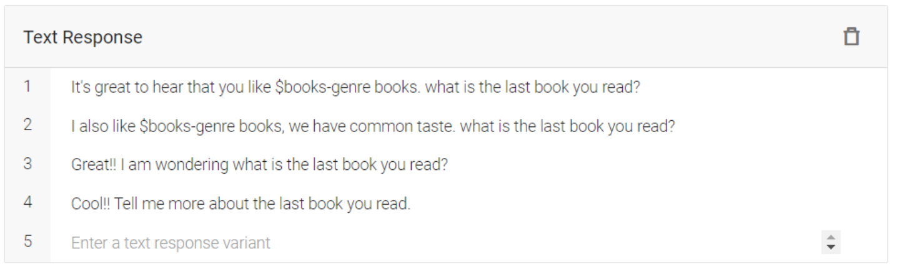
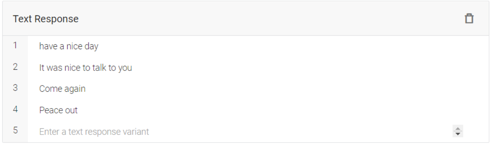

# Ktaby Chatbot using Google Dialogflow
You can try Ktaby Chatbot through this [Link](https://bot.dialogflow.com/8b25ae0d-f2ff-4248-a3fe-0fab03545c62)

# Table of Content:
[Objective](#1)

[Team Members](#2)

[Chatbot Subject](#3)

[Ontology](#4)

- [Classes](#5)

- [Data Properties](#6)

- [Knowledge Structure](#7)

[Competency Questions](#8)

[Training Question-Answers](#9)

[Intents](#10)

[Entities](#11)

[Training Phrases](#12)

1. [Default Welcome Intent](#13)

   - [Training Phrases](#14)

   - [Responses](#15)

   - [Test Cases](#16)

2. [Search-for-books](#17)

3. [Books-genres](#18)

4. [First scenario: The user knows the last book](#19)

5. [Second scenario: The user doesn't Know](#20)

6. [Intents for a specific genre](#21)

   - [Industry](#29)

   - [Education](#22)

   - [Philosophy](#23)

   - [Science](#24)

   - [Test cases for genres](#25)

7. [Goodbye Intent](#26)

[Evaluation](#27)

[Weaknesses](#28)

[Try Ktaby](#30)

# <a name ="1">Objective</a>

The project was part of our AI & Data Science Master's degree at the University of Ottawa. 

Check all the projects here: [Link](https://github.com/Mostafanofal453)

# <a name = "2">Team Members </a>

[Gehad Hisham](https://www.linkedin.com/in/gehad-hisham/)

[Kareem Bakli](https://www.linkedin.com/in/kareem-bakli-b48228138/)

[Kareem Khaled](https://www.linkedin.com/in/kareemwaly/)

[Mostafa Nofal](https://www.linkedin.com/in/mostafa-nofal-772625194/)

# <a name="3">Chatbot Subject</a>

Katby Chatbot is an intelligent book recommendation system which can recommend similar or new books to the reader based on his interest.

# <a name="4">Ontology</a>

## <a name ="5">Classes</a>

First we determine our ontology classes:

- **Person Class** which includes two sub classes:

  1. New user

  2. Registered user.

- **Book Class** which includes Five sub classes:

  1. Biology

  2. Education

  3. Science

  4. Philosophy

  5. Industry

   

  **Then**, **Sub Class** Industry has another five sub classes:

  1. Engineering

  2. Physics

  3. Computer Hardware & Software

  4. Architecture

  5. Chemistry

## <a name ="6">Data Properties</a>

- **Each sub class of Book has following attributes:** 

  1. Book Author

  2. Book Price

  3. Book Nam

  4. Book Press

  5. Book Rate

- **Each sub class of Person has attributes**

  1. Person Age

  2. Name 

  3. Interest

## <a name ="7">Knowledge Structure</a>

# <a name="8">Competency Questions</a>
1. Can you suggest to me a good Industry book ?

2. I would like to read education book.

3. I am a casual reader and love to read sci-fi and fantasy books.

4. The last book I read was Harry Potter.

5. I do not have an information right now for this request.

6. I want to search for a book.

# <a name="9">Training Question-Answers</a>
## <a name ="10">Intents</a>

First is have the welcome intent. Intent to search for the books. and ask the user about his favorite genre. Then the intents which include the variety of specializations.

## <a name ="11">Entities</a>

We made entity for book genre which is general form of searching for the genre and we have also specific entities for specific keywords in the genre.

## <a name ="12">Training Phrases</a>

Now we will take a closer look at the training and responses of the intents.

## <a name ="13">1. Default Welcome Intent</a>

For the default welcome intent, we have the basic sentences to open the dialogue and the chatbot will respond with the name and small description about it.

### <a name ="14">Training Phrases</a>

### <a name ="15">Responses</a>

### <a name ="16">Test Cases</a>

1. heya

2. howdy

3. hi there

4. greetings

5. hello again

## <a name ="17">2. Search-for-books</a>

Now we have the step to search for the books. The user can ask questions whether its suggesting, recommending or searching for books. In our scenario we made the chatbot ask the user about his favorite genre.

**Training Phrases**

**Responses**

**Test Cases**

1. Book recommendation

2. Recommend me a good book

3. Let's buy a book

4. I hope to read a book

5. I would like to read a book

## <a name ="18">3. Books-genres</a>

So next is books-genres intent. It includes the books-genre entity which decided the field of the book the user interested in. Here the chatbot will respond with some good responses include the same field that he chose and then ask him for the name of the last book he read.

**Training Phrases**

**Responses**

**Test Cases**

1. I want something for my children 

2. I like to read action books 

3. Fiction 

4. Horror

## <a name ="19">4. First scenario: The user knows the last book</a>

For the first scenario he will recommend him books related to the book he chose.

**Training Phrases**

**Responses**

**Test Cases**

1. The last book I read was Rebecca.

2. The last book was Rebecca 

3. I read The Frankenstein 

4. I love The Westing Game

## <a name ="20">5. Second scenario: The user doesn't Know</a>

The second scenario is that he doesn’t know, or he don’t remember so we will recommend him books directly.

**Training Phrases**

**Responses**

**Test Cases**

1. I am not 100% sure

2. I forgot

3. I have no idea

4. I haven’t a clue

5. I haven’t got the faintest idea

## <a name ="21">6. Intents for a specific genre</a>

Now these are the intents that we discussed before. It’s for every specific genre individually. We made 4 genres: industry, education, philosophy and science. We did the same steps for every genre, and everyone has its own entity.

### <a name ="29">Industry</a>

**Training Phrases**

**Responses**

### <a name ="22">Education</a>

**Training Phrases**

**Responses**

### <a name ="23">Philosophy</a>

**Training Phrases**

**Responses**

### <a name ="24">Science</a>

**Training Phrases**

**Responses**

### <a name ="25">Test cases for genres</a>

1. I want something for my fictional interests

2. I like to read action books

3. Detective books 

4. Mathematics books

## <a name ="26">7. Goodbye Intent</a>

Finally, the intent for goodbye and thanks.

**Training Phrases**

**Responses**

**Test Cases**

1. See you soon 

2. Have a nice day

3. Good night

4. Farewell

# <a name="27">Evaluation</a> 

We tried the chatbot with our test cases. Most of them were correctly identified because they have relative words with the trainings intents but some of them were hard to identify and the chatbot returned to the default fallback intent.

| Sample 1                  | Sample 2                  |
| ------------------------- | ------------------------- |
|  |  |

| Sample 3                  | Sample 4                  |
| ------------------------- | ------------------------- |
|  |  |

**Sample 5**

# <a name ="28">Weaknesses</a>

Here are some of the weaknesses: 

- The intents are limited. We included just 4 genres so if the user entered different genre, it will not be identified. 

- Some intents may contain similar keywords with each other’s, so this confuses the chatbot and give us the wrong response. 

- When we tried to input words but in different languages, it didn’t catch it

# <a name ="30">Try Ktaby</a>

You can try Ktaby Chatbot through this [Link](https://bot.dialogflow.com/8b25ae0d-f2ff-4248-a3fe-0fab03545c62)
